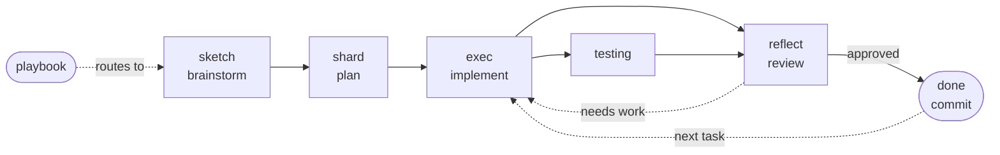

# skills

My personal Claude Code skills. They match how I already build. I stay in control, the
work stays cheap, and I look at everything before it ships.

I keep them personal on purpose. You can borrow a skill that wraps vendor docs. A skill
that wraps how someone works only fits that person, so take the idea and write your own.

## How I work with an agent

I'm the architect. I decide what we build and why. The agent moves fast, argues when I'm
wrong, and does the typing. It works with me, sometimes like a co-founder, but it never
runs on its own.

Every idea has to hold up before we build it. That's the job of `sketch`. The agent
pushes on the idea, and a lot of ideas that sound good turn out to have weak reasoning,
or they don't fit the project once you look closely. It's much cheaper to find that out
while we're still talking. This goes the other way too. Once an idea holds up, the agent
should get behind it and stop inventing objections just to seem careful.

Anything the agent writes is a draft. It counts as done only after I've checked it.
Checking might mean a real test, a quick manual run, a code review, or just reading the
diff line by line. Whatever gets me to trust the change.

This is why I keep tasks small. A small diff is easy to read and easy to test. It's also
cheap to throw away when the approach was wrong, and getting it wrong and redoing it is
most of the work. Small steps keep that from hurting.

Commits wait for me. The agent builds, hands back a dirty tree, and stops. It doesn't
commit, and it won't start the next task while this one is still uncommitted. A dirty
tree means we aren't finished here.

## The workflow

`playbook` is the front door. It holds the ground rules and sends you to whichever stage
a task needs. Every stage is optional, so skip the ones a task doesn't need.



### `playbook`

The router. It sets the frame. I drive, the work stays in one context, and cost stays
low. You don't run playbook to do work. You run it to get your bearings at the start of
a build, or when you've lost track of which stage you're in.

`/playbook I want to build X`

### `sketch`

Brainstorming, before any code. I bring a rough idea and the agent kicks it around. It
pokes holes, offers a couple of alternatives, and asks about the parts I left vague.
Nothing gets implemented here. The agent won't rubber-stamp me, and it won't keep
fighting once the idea is solid.

`/sketch here's a rough idea: <...>. Poke holes in it.`

### `shard`

Planning. The concept becomes a few small files instead of one big PRD. `overview.md`
says what the project is, the stack, the conventions, and what the key words mean here.
`roadmap.md` is the ordered task list a fresh session starts from. Each feature gets its
own `spec-<feature>.md`. Every spec ends with a task checklist, and each task is small
enough to review in one diff but still big enough to do something on its own.

`/shard`

### `exec`

Building, one task at a time, in the main session. It reads the overview and the one
spec it needs, and it edits instead of rewriting. It keeps subagents off for the build
itself, though it will use one for real research or a hard piece that stands on its own.

You get back a small diff and a stop, plus a note on how to check the work. The note
says what deserves a test, what to click through by hand, and how to reproduce it. The
agent won't commit, tick the checkbox, or move to the next task. It also hands UI back
to me to look at instead of driving a browser and guessing from screenshots.

One habit pays off here. Start each task in a fresh session. A session that runs across
five tasks gets expensive and sloppy, and a new session gets its bearings from the
overview and roadmap in seconds, so there's no reason to let them run long.

`/exec` takes the first open task, or you can name the one you want.

### `testing`

Optional. It writes real test cases, either unit tests or scripted end-to-end ones, so a
pass or fail decides things. I'd rather that than have the agent stare at a screenshot
and call it. That drifts, and it wastes tokens. How something looks and feels is my call.

`/testing` when the logic is worth locking down. Skip it for plumbing.

### `reflect`

Optional, and mostly about cutting. An agent left alone keeps piling on code, so this
pass looks for the duplicate it just wrote, the two paths that should be one, and the
lines that aren't doing any work. It flags things and suggests fixes. It doesn't block.
I read the diff and make the call. The goal is code I'll still understand next week.

`/reflect` before I call a task done.

### `done`

The other half of `exec`. Exec won't commit by itself, so `/done` is how I sign off. It
ticks the roadmap box and commits everything, both the code and the checkbox, in one
commit, then stops. I get back a hash, a one-line summary, and a pointer to what's next.
It won't push, branch, or start the next task. Running it already means I've approved, so
it doesn't ask again.

`/done`, or `/done "your message"` to set the commit message yourself.

## Cost rules

A few things hold across every stage.

- One context beats subagents for real work. Spinning one up copies context and hands
  back a result, and that's all fresh tokens. Save it for throwaway research or a hard
  piece you can box off. The everyday build wants the context you've already built up.
- Small files beat big ones. They're cheaper to read, cheaper to edit, and easier to
  cache.
- Editing beats rewriting. A big rewrite tempts the model to redo the whole file.
- The agent advises and I decide. It can rank what worries it, but it never blocks a
  merge.

## Install

Symlink each one into `~/.claude/skills/` so they're available in every project.

```sh
for s in playbook sketch shard exec testing reflect done; do
  ln -sfn "$PWD/$s" "$HOME/.claude/skills/$s"
done
```

They turn on by themselves when a task matches, or you can call them by hand with
`/playbook`, `/sketch`, `/shard`, `/exec`, `/testing`, `/reflect`, and `/done`.
